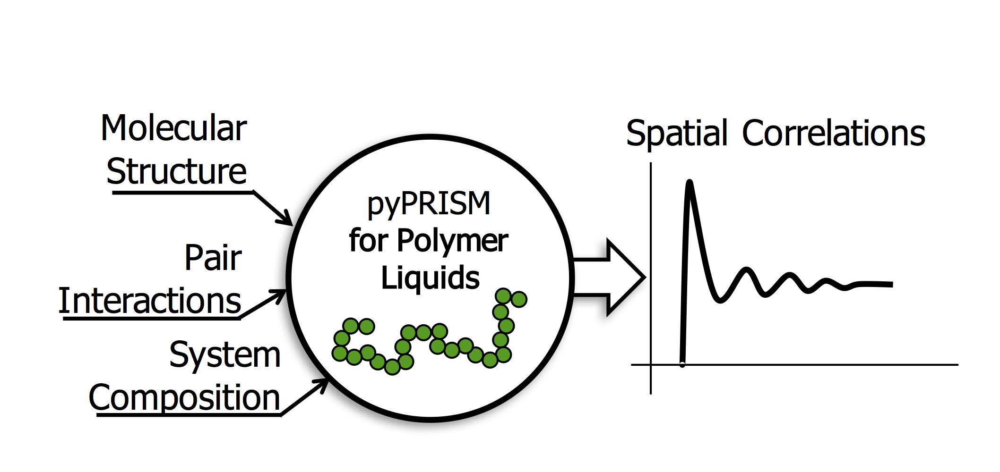

<p align="center">
    
</p>
<h1 align="center">pyPRISM</h1>

<p align="center"> 
<a href='http://pyprism.readthedocs.io/en/latest/?badge=latest'>
    
</a></p>
<p>
Polymer reference interaction site model (PRISM) theory describes the correlations of liquid-like polymer systems including melts, blends, solutions, and composites. Using PRISM theory, one can calculate thermodynamic (second virial coefficient,  interaction parameters, potential of mean force) and structural (pair correlation functions, structure factor) descriptors with either little to no use of mean-field assumptions. Unlike computationally expensive molecular dynamics or Monte Carlo simulations, PRISM theory can be numerically solved in seconds or minutes and doesn’t suffer from finite-size effects. Here, we present a Python-based, open-source framework for conducting PRISM theory calculations: pyPRISM aims to simplify PRISM-based studies by providing a simplified scripting interface for numerically solving the PRISM equations. pyPRISM also provides data structures that simplify PRISM calculations which allows it to be extended for use in non-prediction tasks such as for coarse-graining of atomistic simulation force-fields or the modeling of experimental scattering data. The goal of providing this framework is to reduce the barrier to accurately using PRISM theory for experts and non-experts alike and provide a platform for future PRISM and liquid-state theory innovations. 
</p>

<p align="center"> <b>If you use pyPRISM in your work, you <i>must</i> cite both of the following articles</b></p>

1. Martin, T.B.; Gartner, T.E III; Jones, R.L.; Snyder, C.R.; Jayaraman, A.;
pyPRISM: A Computational Tool for Liquid State Theory Calculations of
Macromolecular Materials (to be submitted)

2. Schweizer, K.S.; Curro, J.G.; INTEGRAL EQUATION THEORY OF THE STRUCTURE OF POLYMER MELTS, Physical Review Letters, 1987, 58 (3) p246-249 doi: http://dx.doi.org/10.1103/PhysRevLett.58.246


Example
=======
Below is an example python script where we use pyPRISM to calculate the pair correlation functions for a
nanocomposite (polymer + particle) with attractive polymer-particle interactions. Below the script is a plot
of the pair correlation functions from this calculation.

```python
import pyPRISM
from pyPRISM.calculate.pair_correlation import pair_correlation

sys = pyPRISM.System(['particle','polymer'],kT=1.0)
sys.domain = pyPRISM.Domain(dr=0.01,length=4096)
    
sys.density['polymer']  = 0.75
sys.density['particle'] = 6e-6

sys.diameter['polymer']  = 1.0
sys.diameter['particle'] = 5.0

sys.omega['polymer','polymer']   = pyPRISM.omega.FreelyJointedChain(length=100,l=4.0/3.0)
sys.omega['polymer','particle']  = pyPRISM.omega.NoIntra()
sys.omega['particle','particle'] = pyPRISM.omega.SingleSite()

sys.potential['polymer','polymer']   = pyPRISM.potential.HardSphere(sigma=1.0)
sys.potential['polymer','particle']  = pyPRISM.potential.Exponential(sigma=3.0,alpha=0.5,epsilon=1.0)
sys.potential['particle','particle'] = pyPRISM.potential.HardSphere(sigma=5.0)

sys.closure['polymer','polymer']   = pyPRISM.closure.PercusYevick()
sys.closure['polymer','particle']  = pyPRISM.closure.PercusYevick()
sys.closure['particle','particle'] = pyPRISM.closure.HyperNettedChain()

PRISM = sys.createPRISM()

PRISM.solve()

pcf = pair_correlation(PRISM)
```
<p align="center">
    
</p>

Documentation
=============
Code documentation can be found [here](https://pyPRISM.readthedocs.io/). The most up to
date code documentation can always be found by compiling from source. 

Depedencies
===========
The following are the minimum depedencies needed to use pyPRISM:

    - Python 2.6+ or 3+
    - Numpy >= 1.8.0
    - Scipy
    - Cython (not currently but likely in future)

These dependencies are needed to run the tutorial notebooks 
    
    - jupyter
    - matplotlib
    - bokeh
    - holoviews

These depedencies are needed to compile the documentation from source
    
    - sphinx
    - sphinx-autobuild
    - sphinx_rtd_theme


Quick Install
=============
The commands below shoul install pyPRISM with all basic dependences via conda or pip. These commands
should be platform agnostic and work for Unix, OSX, and Windows *if* you have
Anaconda or pip correctly installed.  For full installation instructions please
see the documentation. 

``` bash
$ conda install pyPRISM
```

or

``` bash
$ pip install pyPRISM
```

Contact Us
============
- Dr. Tyler Martin, NIST, 
    [GitHub](https://github.com/martintb),
    [Webpage](https://www.nist.gov/people/tyler-martin),
    [Scholar](https://scholar.google.com/citations?user=9JmVnIIAAAAJ&hl=en)
- Mr. Thomas Gartner, University of Delaware, 
    [GitHub](https://github.com/tgartner),
    [Scholar](https://scholar.google.com/citations?user=lzao5SAAAAAJ&hl=en)
- Dr. Ron Jones, NIST, 
    [Webpage](https://www.nist.gov/people/ronald-l-jones),
    [Scholar](https://scholar.google.com/citations?user=TKAtIUIAAAAJ&hl=en)
- Dr. Chad Snyder, NIST,
    [Webpage](https://www.nist.gov/people/chad-r-snyder),
    [Scholar](https://scholar.google.com/citations?user=MMV7Bf8AAAAJ&hl=en)
- Prof. Arthi Jayaraman, University of Delaware, 
    [Webpage](https://udel.edu/~arthij),
    [Scholar](https://scholar.google.com/citations?user=FST4YmwAAAAJ)


