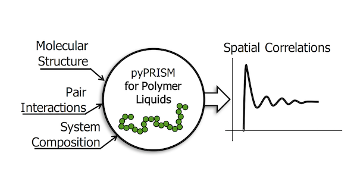

.. pyPRISM documentation master file, created by
   sphinx-quickstart on Sun Sep 17 12:32:11 2017.
   You can adapt this file completely to your liking, but it should at least
   contain the root `toctree` directive.

pyPRISM
=======

pyPRISM is a Python-based, open-source framework for conducting Polymer
Reference Interaction Site Model (PRISM) theory calculations. This framework
aims to simplify PRISM-based studies by providing a user-friendly scripting
interface for setting up and numerically solving the PRISM equations. 

PRISM theory describes the equilibrium spatial-correlations of liquid-like
polymer systems including melts, blends, solutions, block copolymers, ionomers,
liquid crystal forming polymers and nanocomposites. Using PRISM theory, one can
calculate thermodynamic (e.g., second virial coefficients, Flory-Huggins
:math:`\chi` interaction parameters, potentials of mean force) and structural
(e.g., pair correlation functions, structure factors) information for these
macromolecular materials. See the :ref:`faqs` section for examples of systems
and calculations that are available to PRISM theory.

pyPRISM provides data structures, functions, and classes that streamline PRISM
calculations, allowing pyPRISM to be extended for use in other tasks such as
the coarse-graining of atomistic simulation force-fields or the modeling of
experimental scattering data. The goal of this framework is to reduce the
barrier to correctly and appropriately using PRISM theory and to provide a
platform for rapid calculations of the structure and thermodynamics of
polymeric fluids and nanocomposites. 

**If you use pyPRISM in your work, we ask that you please cite both of the following articles**

    1. Martin, T.B.; Gartner, T.E. III;  Jones, R.L.; Snyder, C.R.; Jayaraman,
       A.; pyPRISM: A Computational Tool for Liquid State Theory
       Calculations of Macromolecular Materials [`link <https://dx.doi.org/10.1021/acs_macromol_8b00011>`__]

    2. Schweizer, K.S.; Curro, J.G.; Integral Equation Theory of the Structure
       of Polymer Melts, Physical Review Letters, 1987, 58 (3) 246-249
       doi:10.1103/PhysRevLett.58.246
       [`link <https://doi.org/10.1103/PhysRevLett.58.246>`__]

.. image:: ../img/GitHubLogo.png
    :align: center
    :target: https://github.com/usnistgov/pyprism

.. toctree::
    :maxdepth: 1
    :caption: Code Reference

    api/pyPRISM

.. toctree::
    :maxdepth: 2
    :caption: Setup

    install/install
    quickstart
    tutorial/tutorial

.. toctree::
    :maxdepth: 2
    :caption: Knowledgebase

    faq
    scprism
    convergence

.. toctree::
    :maxdepth: 2
    :caption: Miscellaneous 

    contribute
    contact
    legal

