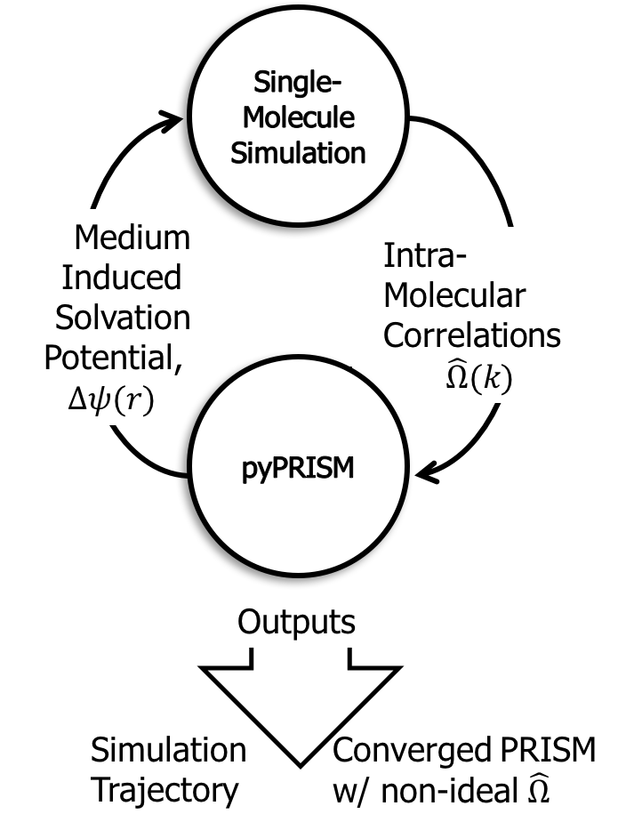

.. _SCPRISM:

Self-Consistent PRISM Method
============================

One of the original weaknesses of PRISM theory was the lack of explicit
coupling between intra- and inter-molecular correlations. This means that the
global, inter-molecular structure of a system could not affect its
intra-molecular structure.  In the past, this limited PRISM calculations to
systems where ideality assumptions could be invoked thateffectively de-coupled
the intra- and inter-molecular correlations. The Self-Consistent PRISM Method
(SCPRISM) circumvents this limitation by combining PRISM theory and molecular
simulation. Single-molecule simulations are used to calculate the
intra-molecular correlation functions which are passed to a PRISM theory
calculation. PRISM theory is then used to calculate an effective
solvation potential (see :func:`pyPRISM.calculate.solvation_potential`)
which is fed back to a new single-molecule simulation. This solvation potential
modifies the pairwise interactions of the molecule to account for the effect of
a medium (solvent or polymer matrix) which is not explicitly represented in the
single-molecule simulation. This self-consistent cycle gives the intra- and
inter-molecular correlations a feedback loop in which the two levels of
correlations can affect one another.

pyPRISM is fully able to conduct SCPRISM studies in its current form. The
developers are working on expanding the discussion of SCPRISM, adding a SCPRISM
tutorial notebook, and creating helper utilities for SCPRISM calculations.
These include helper functions which interface with common molecular simulation
packages. 
